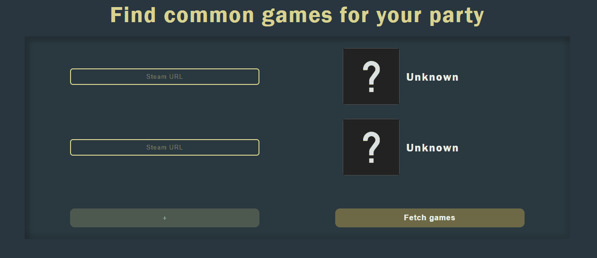

# Common Games Finder for Steam
  
* User can add up to 5 inputs
* When user puts steam URL, profile would be fetched and displayed (if valid and exists)
* When user sumbits form, games would be fetched and displayed.
* User can hover over game card and open this game on steam market or run it on computer.

<a href="https://tekkenthuuug.github.io/common-steam-games/"><strong>LIVE DEMO</strong></a>

